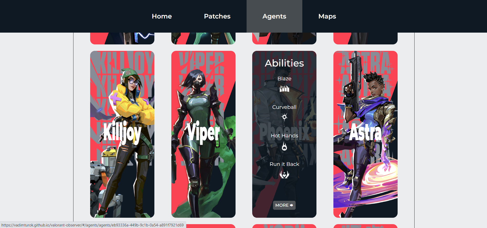
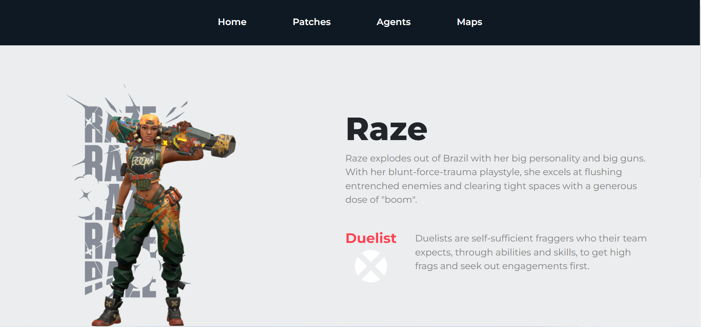

# 📝Valorant Observer - valornat game overview
> Live demo
>  [_here_](https://vadimturok.github.io/valorant-observer/#/).

>API fro this project you canf find [_here_](https://valorant-api.com/).

## Table of Contents
* [Technologies Used](#technologies-used)
* [Features](#features)
* [Screenshots](#screenshots)
* [Setup](#setup)
* [Project Status](#project-status)
* [Contact](#contact)
<!-- * [License](#license) -->


## Technologies Used
- React - version 18.1.0
- AOS - version 2.3.4
- Redux Toolkit - version 1.8.1
- Axios - version 0.27.2
- TypeScript - version 4.6.3


## Features
- Animated app header
- Animated text and pictures
- Flip cards
- CSS modules
- Cool design


## Screenshots


<!-- If you have screenshots you'd like to share, include them here. -->


## Setup
To run React application: open 'client' folder

Run following commands:

```
npm install
npm start
```


## Project Status
Project is: _completed_


## Contact
Contact with me via e-mail: turokvadim2510@gmail.com or on Twitter: [Vadim Turok](https://twitter.com/stefanio228)


<!-- Optional -->
<!-- ## License -->
<!-- This project is open source and available under the [... License](). -->
